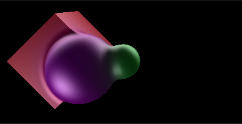
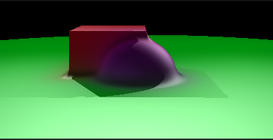
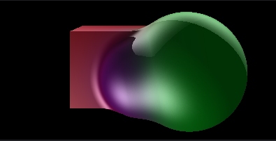
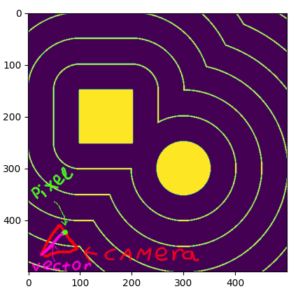
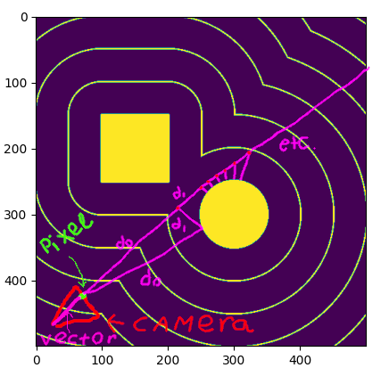
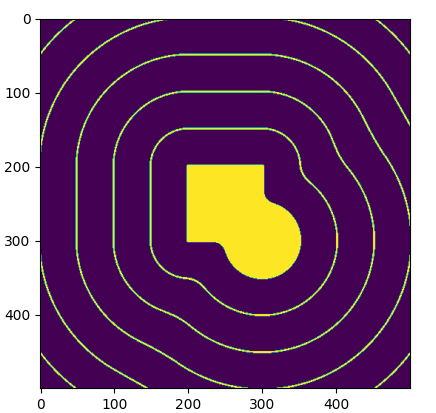
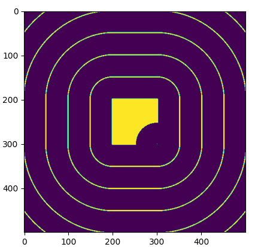
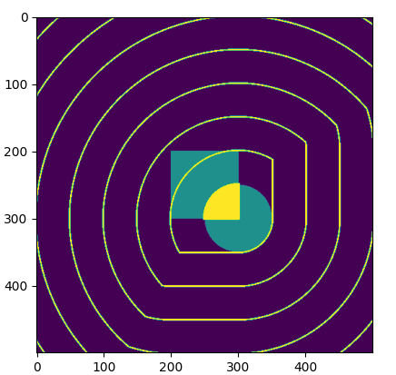
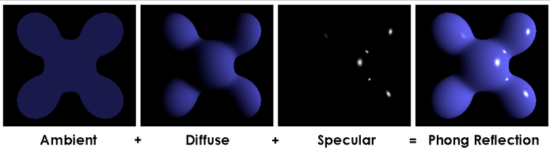

**Render examples**







**Basic description of the algorithm**

each object is described by the SDF (signed distance function)

SDF example for sphere and cube (two-dimensional)


A vector describing the ray for a given pixel is constructed from the camera



then the ray *increases* by the SDF value at a given point
until it either becomes too long (=> the object has not been crossed) or
the SDF value for this vector becomes small enough(=> the object has been crossed)

it will look something like this



also, raymarching allows you to make a smooth transition between
two objects, intersect objects, and the difference between objects

merge example



difference example



intersection example



**Scene settings**

all the objects (position, shaders etc), object relations (like merge), camera position and light sources are described
in .xml configuration file 

you have to pass it to the programs arguments (you can find xml config example in ./src/scene_config.xml)

```bash
./ray-marching path-to-xml/scene_config.xml
```

.xml file is parsing to a tree in the ./IO/xml_parser.c (with basic xml syntax checks) and then
tree is converted into a structure scene in the ./IO/xml_tree_to_scene_converter with structure checks (that necessary fields
 are described in xml file), all the structures are described in field_meta_description structure

```c
struct field_meta_description{
    char* field_name;
    bool is_array;
    size_t field_size;
    size_t displacement;
    union {
        void (*primitive_handler)(const char *data, void *field_address);
        void (*non_primitive_parser)(struct xml_tree* xml_tree, struct field_meta_description* array_description, void *field_address);
    };
    struct field_meta_description* inner_structures;
};
```

and convertion is going depends on structures fields description, if you wanna add some custom maps, shaders, or object 
relations, you should first implement them and then add their names into available functions array in the ./IO/xml_tree_to_scene_converter
 just to let converter know if this functions exists

but you are also allowed to configure scene straight in code with out parsing xml file in ./scene_meta_inf/scene.c setup_scene_settings
 this describing method is just a little bit more flexible, and faster, and I haven't debbuged xml parsing and convertion to 
struct properly

**Realization description**

All information about scene is stored in structure scene (./scene_meta_inf/)

```c
struct scene{
    struct camera* scene_camera;
    struct vec3* light_sources;
    int light_sources_count;
    struct object* scene_objects;
    int scene_objects_count;
    struct object_relationship* object_relations;
    int object_relations_count;
};
```

structure camera is describing camera position and rotation (./scene_meta_inf/)

```c
struct camera {
    struct vec3 camera_position;
    struct vec3 camera_rotation;
};
```

light_sources is just an array of light points position

object structure is describing all necessary, for rendering, information about object (./object/)

```c
struct object {
    struct vec3 position;
    struct vec3 color;
    float size;
    float (*map)(struct object* obj, struct vec3* ray_pos);
    struct shader *shader;
    struct rotation *rotation;
};
```

map function is a SDF of this object, shader structure defines shader, according to objects color (./shader/)

```c
struct shader{
    float ambient;
    float alpha;
    float diffuse;
    float specular;
    struct vec3 (*process_shader)(struct vec3* pos, struct vec3* color, struct scene* scene, struct shader* shader);
};
```

process_shader function is a function, that calculating color of current pixel, according to vector position, object
color,
shader values, and some information about scene(camera position and light sources positions)

ambient, alpha, diffuse and specular are values needed for phong reflection (alpha used in its formula)



structure rotation (in struct object) is a structure describing rotation in a few possible ways(now matrix and
quaternion) (./rotation_stuff/)

```c
enum rotation_type {
    MATRIX_ROTATION = 1,
    QUATERNION_ROTATION = 2
};

struct rotation {
    struct vec3 rotation_angles;
    enum rotation_type rotation_type;
    union {
        float rotation_matrix[9];
        float quaternion[4];
    };
    void (*calculate_rotation)(struct rotation *mr);
    void (*apply_rotation)(struct vec3 *vector, struct rotation *mr);
};
```

it contains rotation angles, data necessary for rotation, and functions for calculating this data and applying rotation
to vector

structure object_relationship describing SDF's like merging, difference or intersection (./object/)

```c
struct object_relationship {
    struct object *objects;
    int object_count;

    float (*map)(struct vec3 *ray_pos, struct object *objects, int object_count);

    struct vec3 (*process_shaders)(struct vec3 *pos, struct scene *scene, int relation_index);
};
```

it contains array of objects, function that returns the processed value of the SDF objects, and shader function,
that smoothes shader or just returning closer object shader

all *raymarching logic* is in ./ray_marching/

by the way phong reflection uses the normal at this point, which is calculated in this function using a
numerical approximation of the gradient of the mapping function of the entire scene(./ray_marching/ray_marching.c)

```c
struct vec3 get_normal(struct vec3 *vector, struct scene *scene) {
    struct vec3 ret;
    ret.x = map(&(struct vec3) {vector->x + NORMAL_TRASH_HOLD, vector->y, vector->z}, scene) -
            map(&(struct vec3) {vector->x - NORMAL_TRASH_HOLD, vector->y, vector->z}, scene);
    ret.y = map(&(struct vec3) {vector->x, vector->y + NORMAL_TRASH_HOLD, vector->z}, scene) -
            map(&(struct vec3) {vector->x, vector->y - NORMAL_TRASH_HOLD, vector->z}, scene);
    ret.z = map(&(struct vec3) {vector->x, vector->y, vector->z + NORMAL_TRASH_HOLD}, scene) -
            map(&(struct vec3) {vector->x, vector->y, vector->z - NORMAL_TRASH_HOLD}, scene);
    normalize(&ret);
    return ret;
}
```

mapping function takes current position and scene structure, then calculating smallest value of all maps
(object relations also) (./ray_marching/ray_marching.c)

```c
float map(struct vec3 *vector, struct scene *scene) {
    float min_map = UPPER_TRASH_HOLD;
    for (int i = 0; i < scene->scene_objects_count; i++) {
        float current_map = scene->scene_objects[i].map(&scene->scene_objects[i], vector);
        if (current_map < min_map) {
            min_map = current_map;
        }
    }
    for (int i = 0; i < scene->object_relations_count; i++) {
        float current_map = scene->object_relations[i].map(vector, scene->object_relations[i].objects,
                                                           scene->object_relations[i].object_count);
        if (current_map < min_map) {
            min_map = current_map;
        }
    }
    return min_map;
}
```

pixel color is calculating in ray_marching/ray_marching.c render_pixel function, according to its position on the screen and scene information
pixel position is given in (struct vec3) {0, x, y}, when x and y are pixel coordinates normalized to [-1, 1]

it simply finds out that the ray released from a given camera pixel intersects the object, and if so, returns the color
obtained by using its shader

**render wrapper**

render goes in the main.c main function, first image sizes are defined, then it's allocating memory
for rendered image, takes scene structure from setup_scene_settings, preparing all objects rotations
then for each pixel it calculates uv, and calling render_pixel function from ./ray_marching/ray_marching.c
to get its color, than it's frying all the allocated memory and writes rendered image

**saving render**

rendered image is saved to .bmp file in function ./IO/bmp_writer.c write_bmp_file it takes path for saving, unsigned char buffer 
(rendered image) and its size

**P.S.**

now dropped shadow works weirdly, so it can be just turned off in ./shader/shader.c diffuse_and_specular_shader function

just comment this "if" and ray calculation:

```c
    //... some code
    struct ray_march_return rmr = march_ray(pos, &pos_light_vector, scene);
    if (!rmr.is_crossed) {
        //... some more code
    }
    //... other code
```
